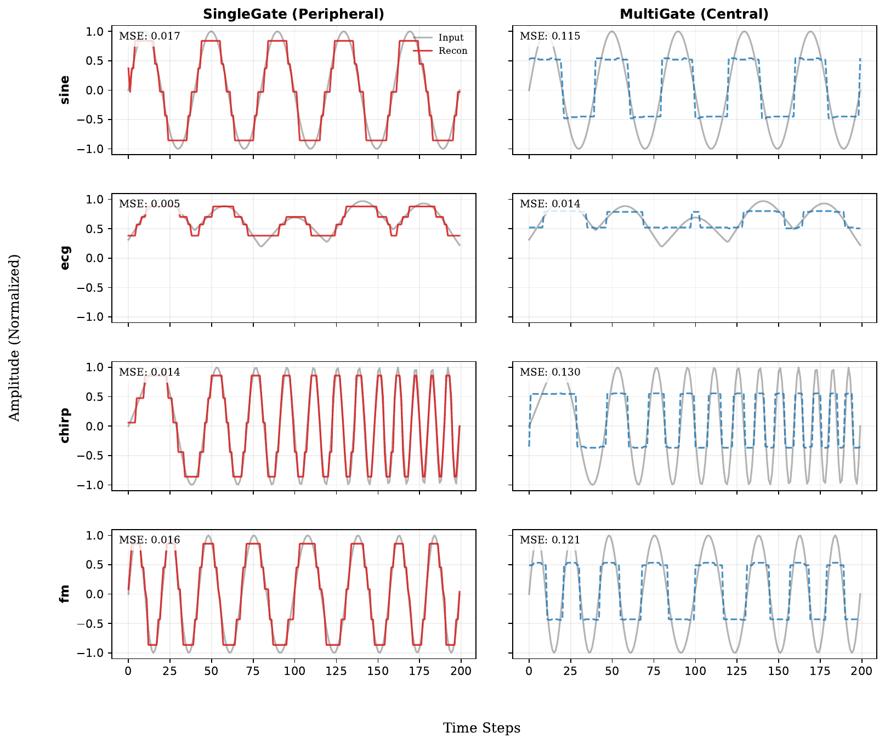

This page provides a comprehensive overview of the experiment suite validating the five axioms of Clock-Selected Compression Theory (CSCT). For exact definitions, loss functions, and equations, see the manuscript source in `paper/main.tex`.

## Quick Navigation

| Experiment | Topic | Axiom Tested |
|------------|-------|--------------|
| [EX1](#ex1--single-channel-waveform-discretization) | Single-Channel Waveform Discretization | A1 (Streams) |
| [EX2](#ex2--multi-channel-relational-information) | Multi-Channel Relational Information | A3 (Multi-Clock) |
| [EX3](#ex3--k-dependency-analysis) | Codebook Size (K) Dependency | A2 (Simplex) |
| [EX4](#ex4--anchor-role-noise-floor-vs-drift) | Open vs Closed Regime | A4 (Irreversible Anchor) |
| [EX5](#ex5--binding-problem) | Feature Binding via Common Clock | A3 (Multi-Clock) |
| [EX6](#ex6--frozen-code-category-recognition) | Category Detection (Frozen Codebook) | A2 (Simplex) |
| [EX7](#ex7--relational-internal-time) | Relational Internal Time | A3 (Multi-Clock) |
| [EX8](#ex8--semantic-grounding-via-convex-hull) | Semantic Grounding | A2 (Simplex) |
| [EX9](#ex9--syntax-inference-via-barycentric-interpolation) | Syntax Inference | A5 (Barycentric Syntax) |

---

## EX1 — Single-Channel Waveform Discretization

### Purpose

EX1 examines the fundamental discretization capability of CSCT at the peripheral processing level. This experiment tests whether **SingleGate architecture** can achieve stable discrete quantization of single-channel waveforms without requiring complex relational processing.

### Hypotheses

- **H1 (SingleGate Sufficiency):** For single-channel waveforms with self-referential anchoring, SingleGate architecture will achieve low reconstruction error.
- **H2 (MultiGate Redundancy):** MultiGate architecture will perform worse than SingleGate on this task, despite having greater representational capacity.
- **H3 (Waveform Generalization):** The performance advantage of SingleGate will hold across diverse waveform types.

### Task Design

The task discretizes a single continuous waveform into a sequence of discrete codes while minimizing reconstruction error. Nine waveform types ensure generalization:

| Waveform | Description |
|----------|-------------|
| sine | Pure sinusoid — basic periodic discretization |
| chirp | Frequency sweep — time-varying frequency adaptation |
| am | Amplitude-modulated — envelope dynamics |
| fm | Frequency-modulated — instantaneous frequency changes |
| ecg | ECG-like with periodic sharp peaks — transient events |
| saw_bl | Band-limited sawtooth — asymmetric waveforms |
| composite | Sum of multiple frequencies — multi-scale representation |
| noisy | Sine + Gaussian noise — noise robustness |
| burst | Intermittent signal — onset/offset handling |

### Method

| Parameter | Value |
|-----------|-------|
| Anchor Configuration | Self-referential (y = x) |
| Codebook Size (K) | 8 |
| Transition Penalty (β) | 50 |
| Sequence Length (T) | 200 |
| Training Steps | 500 |
| Seeds | 20 per condition |

### Metrics

- **Reconstruction Loss (MSE):** $\mathcal{L}_{\text{recon}} = \|x - \hat{x}\|^2$
- **Transition Rate:** Fraction of timesteps where discrete code changes
- **Unique Codes:** Number of distinct codes activated
- **Code Entropy:** Normalized entropy of code distribution

### Results

**Aggregate Statistics (180 paired wave×seed trials):**

| Architecture | Reconstruction Loss | 95% CI |
|--------------|---------------------|--------|
| SingleGate | **0.0381** | [0.0364, 0.0399] |
| MultiGate | 0.0902 | [0.0858, 0.0946] |

**Paired difference:** ΔRecon = 0.0521 (95% CI [0.0480, 0.0561]), d_z = 1.879

<strong>Per-Waveform Results (Click to expand)</strong>

| Waveform | Gate | Recon. Loss | Transition Rate | Unique Codes | Code Entropy |
|----------|------|-------------|-----------------|--------------|--------------|
| am | MultiGate | 0.081 ± 0.015 | 0.205 ± 0.046 | 4.30 ± 1.00 | 0.570 ± 0.115 |
| am | SingleGate | 0.045 ± 0.012 | 0.231 ± 0.030 | 3.85 ± 0.73 | 0.571 ± 0.041 |
| burst | MultiGate | 0.083 ± 0.021 | 0.201 ± 0.035 | 3.50 ± 0.92 | 0.405 ± 0.098 |
| burst | SingleGate | 0.025 ± 0.004 | 0.215 ± 0.022 | 3.85 ± 0.48 | 0.440 ± 0.038 |
| chirp | MultiGate | 0.123 ± 0.011 | 0.253 ± 0.040 | 4.80 ± 0.87 | 0.585 ± 0.078 |
| chirp | SingleGate | 0.042 ± 0.004 | 0.250 ± 0.010 | 4.80 ± 1.03 | 0.592 ± 0.026 |
| composite | MultiGate | 0.083 ± 0.008 | 0.071 ± 0.018 | 4.55 ± 0.92 | 0.527 ± 0.095 |
| composite | SingleGate | 0.053 ± 0.009 | 0.099 ± 0.014 | 4.20 ± 0.60 | 0.580 ± 0.044 |
| ecg | MultiGate | 0.045 ± 0.030 | 0.109 ± 0.020 | 4.55 ± 0.80 | 0.543 ± 0.100 |
| ecg | SingleGate | 0.022 ± 0.006 | 0.074 ± 0.016 | 4.05 ± 1.36 | 0.374 ± 0.056 |
| fm | MultiGate | 0.123 ± 0.010 | 0.189 ± 0.040 | 4.85 ± 0.96 | 0.590 ± 0.099 |
| fm | SingleGate | 0.043 ± 0.004 | 0.184 ± 0.018 | 5.00 ± 0.77 | 0.616 ± 0.021 |
| noisy | MultiGate | 0.072 ± 0.012 | 0.209 ± 0.088 | 4.20 ± 1.08 | 0.511 ± 0.111 |
| noisy | SingleGate | 0.033 ± 0.011 | 0.198 ± 0.042 | 3.90 ± 0.70 | 0.549 ± 0.037 |
| saw_bl | MultiGate | 0.080 ± 0.012 | 0.107 ± 0.047 | 4.05 ± 1.07 | 0.491 ± 0.100 |
| saw_bl | SingleGate | 0.036 ± 0.010 | 0.089 ± 0.012 | 3.55 ± 0.59 | 0.549 ± 0.037 |
| sine | MultiGate | 0.122 ± 0.010 | 0.129 ± 0.035 | 4.50 ± 1.07 | 0.594 ± 0.094 |
| sine | SingleGate | 0.043 ± 0.004 | 0.119 ± 0.015 | 4.75 ± 0.70 | 0.609 ± 0.026 |

### Visual Analysis

**Architecture Comparison (Representative Seed):**

*Left column (SingleGate):* Robust phase-locking and stable discretization (red) accurately tracking input (gray). *Right column (MultiGate):* Fails to capture signal structure, resulting in collapsed representations (blue dashed).

**Convergence Dynamics:**

### Key Findings

Both architectures produce comparable discrete-state statistics (transition rate, code usage, entropy), confirming that Axioms A2–A3 suffice for discretization. However, **MultiGate substantially worsens reconstruction** (large effect size), demonstrating that routing capacity is **unnecessary and detrimental** when no relational ambiguity exists.

---

## EX2 — Multi-Channel Relational Information

### Purpose

EX2 validates the necessity of MultiGate architecture for processing multi-channel signals with **time-varying relationships**. This tests whether independent gating is required when channels exhibit asynchronous dynamics.

### Hypotheses

- **H1 (Failure of Shared Clock):** SingleGate will fail to accurately reconstruct dual-channel signals with varying frequency ratios.
- **H2 (Success of Independent Gating):** MultiGate can assign distinct update timings to each channel.
- **H3 (Relational Encoding):** The combination of discrete codes will implicitly encode the frequency ratio k(t).

### Task Design

Dual-channel dataset coupled by time-varying frequency ratio k(t):
- **Channel 0 (Reference):** $x_0(t) = \sin(2\pi f_0 t)$
- **Channel 1 (Target):** $x_1(t) = \sin(\int_0^t 2\pi f_0 k(\tau) d\tau)$
- **Relational Parameter:** k(t) ∈ [1.0, 2.0], piecewise constant (4 segments)

### Method

| Parameter | Value |
|-----------|-------|
| Anchor Configuration | Reference anchor (y = x₀) |
| Codebook Size (K) | 8 |
| Sequence Length (T) | 400 |
| Training Steps | 1500 |
| Base Frequency (f₀) | 5.0 Hz |
| Seeds | 20 per condition |

### Results

| Architecture | Recon. Loss | Unique Codes | Code Entropy |
|--------------|-------------|--------------|--------------|
| **MultiGate** | **0.063 ± 0.007** | 7.85 ± 0.36 | 0.920 ± 0.042 |
| SingleGate | 0.171 ± 0.039 | 6.85 ± 0.57 | 0.846 ± 0.051 |

**Paired difference:** ΔRecon = −0.108 (95% CI [-0.127, -0.090]), d_z = −2.561

### Visual Analysis

### Key Findings

**Double Dissociation:** SingleGate excels at single-channel tasks (EX1) while MultiGate excels at relational tasks (EX2). This validates the functional division: peripheral processing (SingleGate) for stable integration, central processing (MultiGate) for relational abstraction.

---

## EX3 — K-Dependency Analysis

### Purpose

EX3 investigates the **geometric nature** of discretization. Does CSCT perform "Lebesgue-like" integration (partitioning value/amplitude space) rather than "Riemann-like" integration (partitioning time domain)?

### Hypotheses

- **H1 (K=2, Sign Detection):** Minimal capacity captures signal sign; transitions align with zero-crossings.
- **H2 (Lebesgue-like Partitioning):** For K>2, system partitions amplitude range into discrete bins.
- **H3 (Velocity Constraint):** Transitions are discouraged near extrema (where velocity ≈ 0).

### Method

| Parameter | Value |
|-----------|-------|
| Architecture | SingleGate |
| Input | Pure sine wave (f₀ = 5.0 Hz) |
| Codebook Size (K) | {2, 4, 8, 16} |
| Sequence Length (T) | 300 |
| Training Steps | 2000 |
| Seeds | 20 per K |

### Results

| K | Recon. Loss | Transitions | Zero-Cross Ratio | Extrema Ratio |
|---|-------------|-------------|------------------|---------------|
| 2 | 0.101 ± 0.004 | 10.2 ± 0.8 | **1.000** | 0.000 |
| 4 | 0.041 ± 0.004 | 21.8 ± 2.6 | 0.438 | 0.000 |
| 8 | 0.021 ± 0.005 | 36.6 ± 3.4 | 0.449 | 0.000 |
| 16 | 0.015 ± 0.002 | 48.0 ± 4.0 | 0.546 | 0.000 |

### Visual Analysis

### Key Findings

- **K=2:** 100% of transitions occur at zero-crossings (sign detection)
- **All K:** 0% of transitions occur at extrema (velocity constraint confirmed)
- Reconstruction improves monotonically with K (capacity-driven refinement)

The system performs **value-space partitioning** (Lebesgue-like), not time-domain sampling (Riemann-like).

---

## EX4 — Anchor Role (Noise Floor vs. Drift)

### Purpose

EX4 examines the trade-off between **short-term accuracy** (noise filtering) and **long-term stability** (drift prevention) in anchored vs. autonomous systems.

### Hypotheses

- **H1 (Short-term Noise Cost):** Closed system shows lower error initially due to noise filtering.
- **H2 (Long-term Drift Prevention):** Open system shows lower error long-term due to drift prevention.
- **H3 (Crossover Point):** A crossover T_cross exists, increasing with noise σ.

### Task Design

- **Target:** Sine wave x(t) = sin(t)
- **Internal Model Imperfection:** 3% frequency error (accumulates drift)
- **Anchor:** Noisy sawtooth y(t) = saw(t) + N(0, σ²)
- **Conditions:** σ ∈ {0.05, 0.10, 0.20, 0.30}

### Results

| Noise (σ) | Short MSE (Closed) | Short MSE (Open) | Long MSE (Closed) | Long MSE (Open) | T_cross |
|-----------|-------------------|------------------|-------------------|-----------------|---------|
| 0.05 | 0.017 | **0.013** | 0.460 | **0.012** | 87 |
| 0.10 | **0.017** | 0.046 | 0.460 | **0.043** | 167 |
| 0.20 | **0.017** | 0.149 | 0.460 | **0.147** | 309 |
| 0.30 | **0.017** | 0.272 | 0.460 | **0.273** | 435 |

### Visual Analysis

### Key Findings

- **Short-term:** Closed system wins when σ ≥ 0.10 (noise filtering advantage)
- **Long-term:** Open system wins across **all** noise levels (drift prevention)
- **Crossover:** T_cross scales with σ (lower noise → earlier crossover → anchor more valuable)

**Irreversible anchors provide long-term stability, not immediate accuracy.**

---

## EX5 — Binding Problem

### Purpose

EX5 tests whether a **shared anchor clock** can preserve relative phase relationships between modules despite independent frequency drifts, solving the classic "binding problem."

### Hypotheses

- **H1 (Unbounded Drift without Anchor):** Relative phase error grows unbounded without shared reference.
- **H2 (Bounded Error with Anchor):** Relative phase error remains bounded with shared anchor.

### Task Design

- **Target Signals:** Two sine waves with fixed phase offset (φ = 1.5 rad)
- **Drift Condition:** ±1.5% frequency error in opposite directions
- **Anchor Noise:** σ = 0.1 rad

### Results

| Condition | MSE (Early) | MSE (Late) | Stability Duration | PLV (Late) |
|-----------|-------------|------------|-------------------|------------|
| **Open** | **0.008** | **0.009** | **1.000** | **0.998** |
| Closed | 0.024 | 3.697 | 0.054 | 0.935 |

### Visual Analysis

### Key Findings

Binding can emerge from **shared temporal reference without direct inter-module communication**. The shared anchor acts as "temporal glue," synchronizing internal clocks to preserve relational structure.

---

## EX6 — Frozen-Code Category Recognition

### Purpose

EX6 tests whether **new inference can occur after learning is stopped**. A MultiGate model is trained on a subset of Lissajous categories, then the codebook is frozen. Can it detect a withheld category?

### Task Design

| Shape | Frequency Ratio | Status |
|-------|-----------------|--------|
| ShapeA (Circle) | 1:1 | Trained |
| ShapeB (Figure-8) | 2:1 | Trained |
| ShapeC (Trefoil) | 3:1 | **Withheld** |

### Method

| Parameter | Value |
|-----------|-------|
| Architecture | MultiGate |
| Codebook Size (K) | 16 |
| Training Steps | 2000 |
| Seeds | 50 |

### Results

| Metric | Trained Shapes | Withheld Shape |
|--------|----------------|----------------|
| MSE | 0.050 ± 0.008 | 0.184 ± 0.035 |
| MSE Ratio | — | **3.79× ± 0.91** |
| Detection Success | — | **100% (50/50)** |

**JSD (within-trained vs. to-withheld):** ΔJSd = −0.024 ± 0.048 (not discriminative)

### Visual Analysis

### Key Findings

- **MSE ratio** provides robust OOD detection (100% success, all seeds > 2.0×)
- **JSD fails** to distinguish withheld from trained categories (codebook reuse phenomenon)
- **Ungrounded Symbol Acquisition:** Codes are assigned but lack reconstructable meaning outside the convex hull

---

## EX7 — Relational Internal Time

### Purpose

EX7 examines whether **internal time** (measured as transition rate) scales with external anchor tempo—testing that subjective time is flux-driven, not absolute.

### Task Design

Train once on "Standard World" (f₀ = 0.5 Hz), then deploy (frozen weights) to:
- **Standard:** 0.5 Hz (baseline)
- **Fast:** 0.5 → 1.5 Hz (3× acceleration)
- **Slow:** 0.5 → 0.15 Hz (0.3× dilation)
- **Null:** No input (zero signal)

### Results

| World | Unique Codes | Transitions | Trans./sec | Dilation Factor |
|-------|--------------|-------------|------------|-----------------|
| Fast | 4.00 | 90.2 ± 9.9 | 4.51 ± 0.49 | 1.60× |
| Standard | 4.00 | 56.4 ± 11.5 | 2.82 ± 0.58 | 1.00× |
| Slow | 4.00 | 29.3 ± 3.3 | 1.47 ± 0.17 | 0.52× |
| NULL | **1.00** | **0.0** | **0.00** | — |

### Visual Analysis

### Key Findings

- **Content invariance:** Same 4 codes used across all non-null worlds
- **Duration adaptation:** Transition rate scales with environmental tempo
- **Null halt:** Internal time stops when input flux = 0

The system processes **"change," not "time"**—a form of cognitive relativity.

---

## EX8 — Semantic Grounding via Convex Hull

### Purpose

EX8 investigates whether **semantic grounding** requires geometric compatibility within the learned simplex (Axiom A2). Can a withheld primitive be inferred after codebook freezing?

### Task Design

**Training:** {A, B, A+B, A+C, B+C} — Primitive C never shown alone

**Test (Frozen):** Can the model reconstruct C using only the anchor?

**Geometric Conditions:**
- **IN_HULL:** C = αA + (1−α)B (inside convex hull)
- **RANDOM:** C randomly initialized
- **OUT_HULL:** C ⊥ A, C ⊥ B (orthogonal = outside hull)

### Results

| Condition | Withheld Similarity | Success Rate | Unique Code Acquisition |
|-----------|---------------------|--------------|------------------------|
| IN_HULL | **0.979 ± 0.025** | **96.7% (29/30)** | 96.7% |
| RANDOM | 0.682 ± 0.370 | 53.3% (16/30) | 66.7% |
| OUT_HULL | 0.701 ± 0.242 | 16.7% (5/30) | 80.0% |

**Statistical significance:** Kruskal–Wallis H = 42.52, p = 5.85 × 10⁻¹⁰

### Key Findings

- **Convex hull membership determines grounding:** IN_HULL achieves near-perfect recovery
- **OUT_HULL demonstrates Ungrounded Symbol Acquisition:** 80% acquire unique codes, but only 16.7% succeed in reconstruction
- The code is manipulated, but lacks reconstructable meaning—a mathematical instantiation of the **Chinese Room argument**

---

## EX9 — Syntax Inference via Barycentric Interpolation

### Purpose

EX9 tests whether **syntactic inference** can arise once meaning has been discretized. Can a system infer an **unseen composition rule** under reconstruction-only learning?

### Task Design

**Training:** {A, B, C, A+B, A+C} — Composite **B+C withheld**

**Test (Frozen):** Can the model reconstruct B+C?

### Results

| Condition | Withheld Similarity (B+C) | Success Rate |
|-----------|---------------------------|--------------|
| IN_HULL | **0.890 ± 0.138** | **66.7% (20/30)** |
| RANDOM | 0.767 ± 0.253 | 33.3% (10/30) |
| OUT_HULL | 0.742 ± 0.168 | 13.3% (4/30) |

**Statistical significance:** Kruskal–Wallis H = 19.13, p = 7.00 × 10⁻⁵

### Key Findings

- **Syntax emerges as barycentric interpolation:** The system learns $f: y_{B+C} \mapsto \frac{1}{2}v_B + \frac{1}{2}v_C$
- Unlike meaning (EX8), syntax benefits from geometric scaffold even when withheld primitive is outside hull
- But performance still degrades in OUT_HULL, confirming syntax remains **geometrically constrained**

---

## Summary Table

| Exp. | Task | Key Finding | Axiom |
|------|------|-------------|-------|
| EX1 | Single-channel discretization | SingleGate suffices for self-anchored simple signals | A1 |
| EX2 | Two-channel relation | MultiGate superior for complex relational dynamics | A3 |
| EX3 | Codebook size dependency | K-dependency follows Lebesgue-like geometry | A2 |
| EX4 | Noise vs. drift | Irreversible anchors provide long-term stability | A4 |
| EX5 | Feature binding | Common clock solves binding without concatenation | A3 |
| EX6 | Category recognition | MSE ratio detects novel categories (100% success) | A2 |
| EX7 | Relational time | Internal tempo emerges from flux dynamics | A3 |
| EX8 | Semantic grounding | Meaning requires convex-hull membership (96.7% vs 16.7%) | A2 |
| EX9 | Syntax inference | Syntax emerges via barycentric interpolation (66.7% vs 13.3%) | A5 |

---

For full details, see the manuscript: [10.5281/zenodo.18408862](https://doi.org/10.5281/zenodo.18408862)