This page is a **visual overview** of the experiment suite. For exact definitions, loss functions, and equations, see the manuscript source in `paper/main.tex`.

## Quick navigation

- [EX1 — MultiGate vs SingleGate convergence](#ex1--multigate-vs-singlegate-convergence)
- [EX2 — Lissajous reconstruction (MultiGate vs SingleGate)](#ex2--lissajous-reconstruction-multigate-vs-singlegate)
- [EX3 — K-dependency](#ex3--k-dependency)
- [EX4 — Open vs Closed regime + crossover](#ex4--open-vs-closed-regime--crossover)
- [EX5 — Binding and stability](#ex5--binding-and-stability)
- [EX6 — Category detection after freezing](#ex6--category-detection-after-freezing)
- [EX7 — Relational time](#ex7--relational-time)
- [EX8 — Semantic Grounding via Convex Hull](#ex8--semantic-grounding-via-convex-hull)
- [EX9 — Syntax Inference via Barycentric Interpolation](#ex9--syntax-inference-via-barycentric-interpolation)

---

## EX1 — MultiGate vs SingleGate convergence

**Question.** Does a MultiGate router converge differently than a SingleGate baseline under matched settings?

**Figures.** Seed-mean convergence plots + aggregate summary.

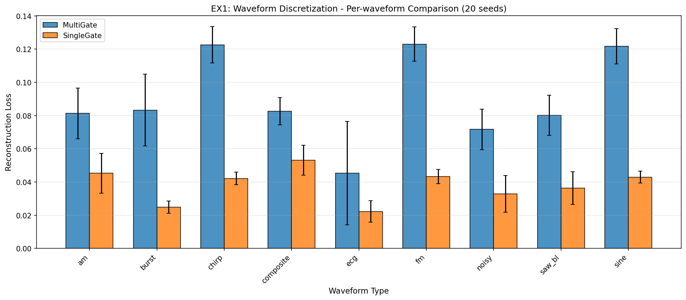

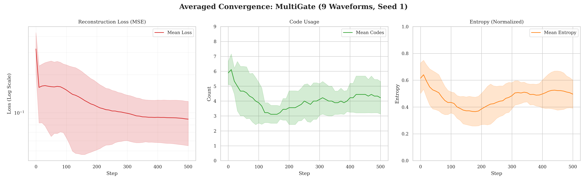

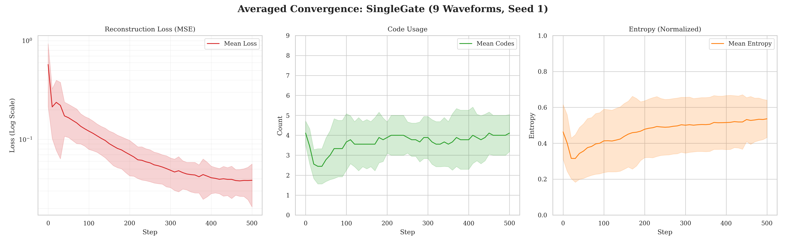

---

## EX2 — Lissajous reconstruction (MultiGate vs SingleGate)

**Question.** Under identical waveform families, does MultiGate improve reconstruction or routing stability versus SingleGate?

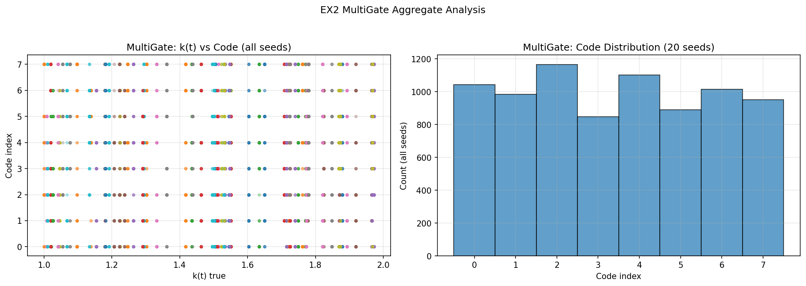

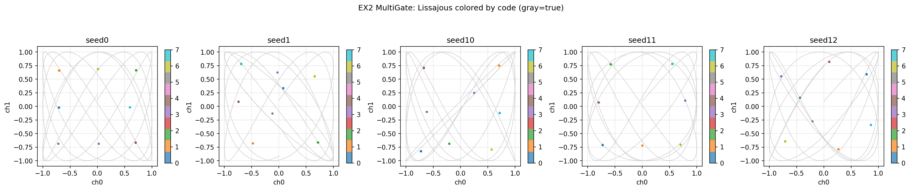

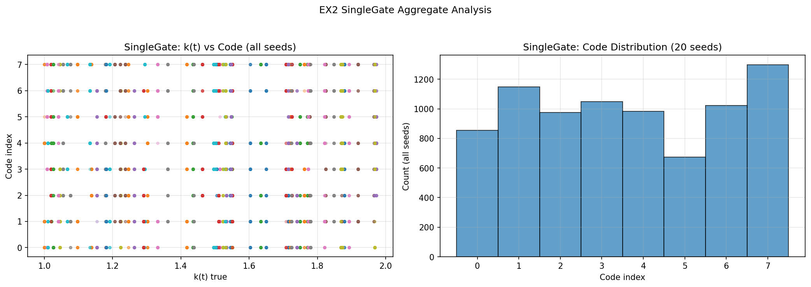

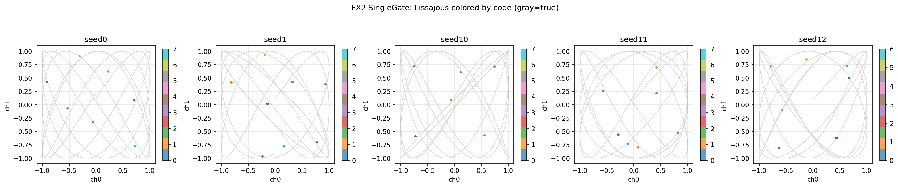

---

## EX3 — K-dependency

**Question.** How does discreteness / code usage behave as a function of the K setting?

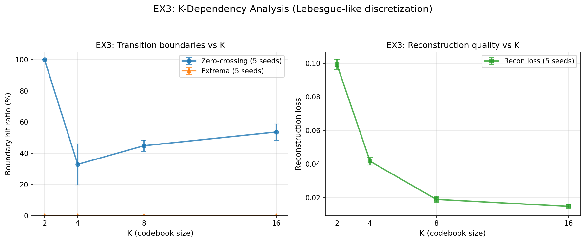

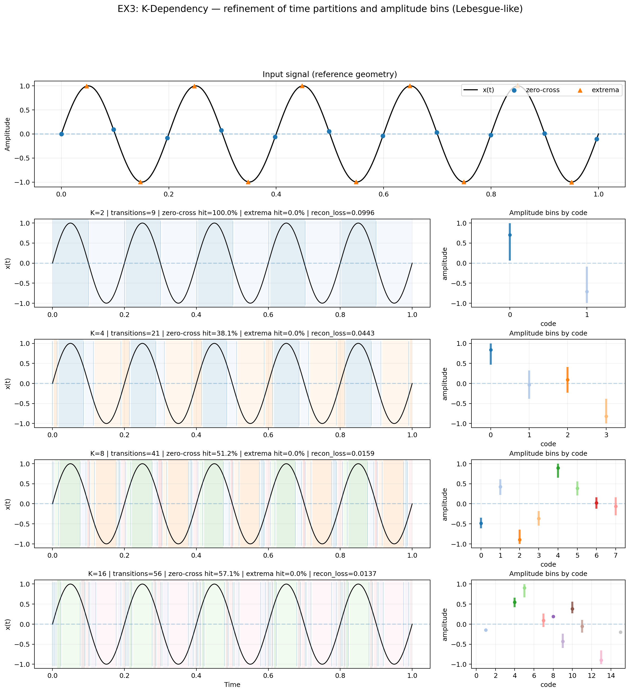

---

## EX4 — Open vs Closed regime + crossover

**Question.** How do errors evolve across regimes, and where does the crossover occur?

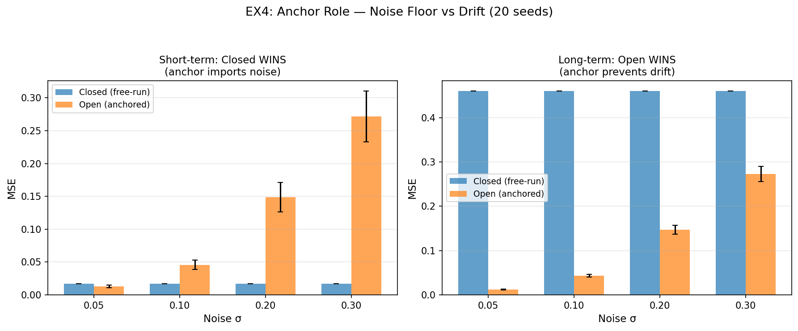

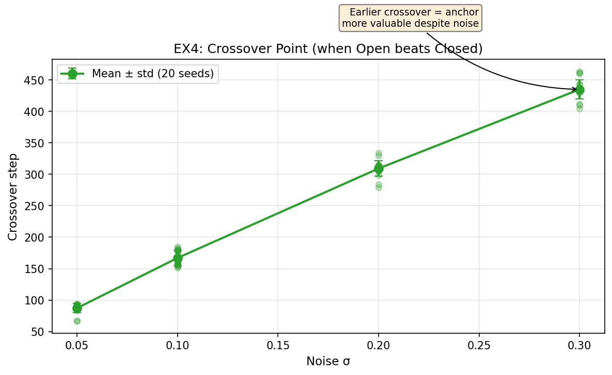

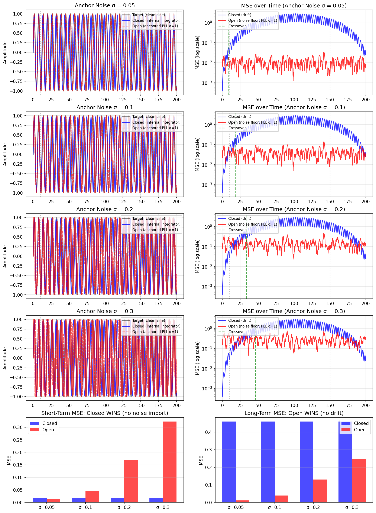

---

## EX5 — Binding and stability

**Question.** How does binding quality relate to stability duration and late-phase alignment?

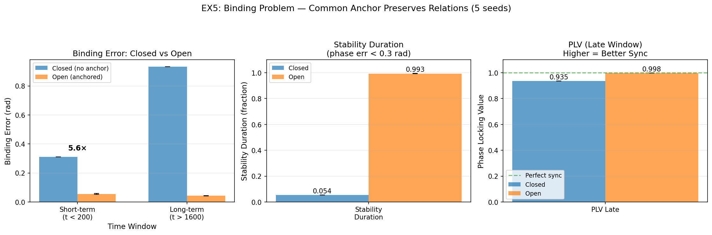

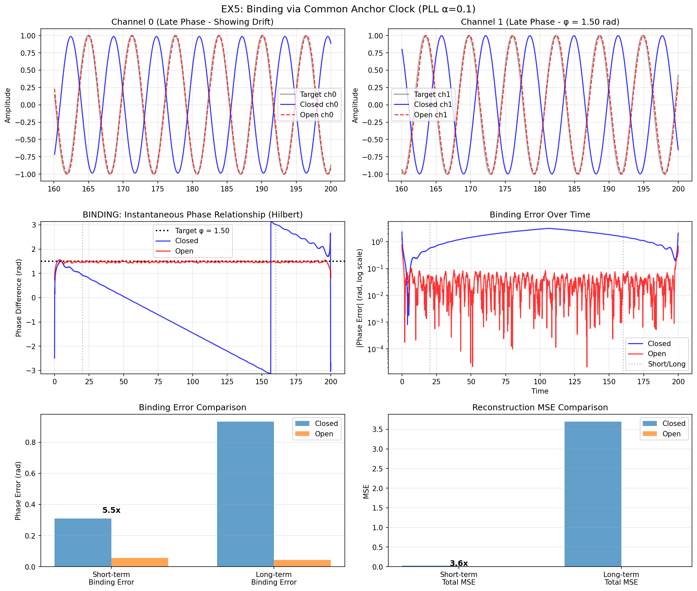

---

## EX6 — Category detection after freezing

**Question.** After freezing the codebook, does MultiGate treat a withheld shape as categorically distinct?

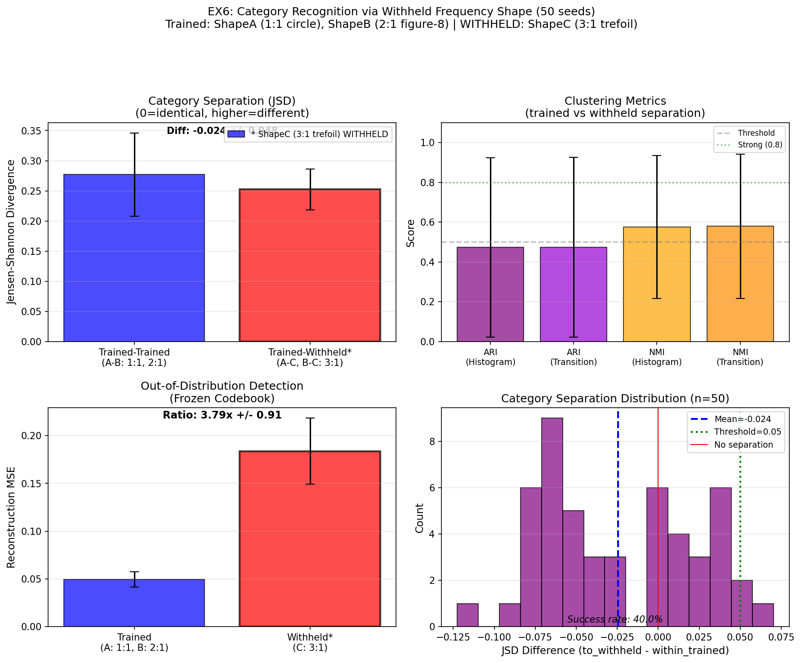

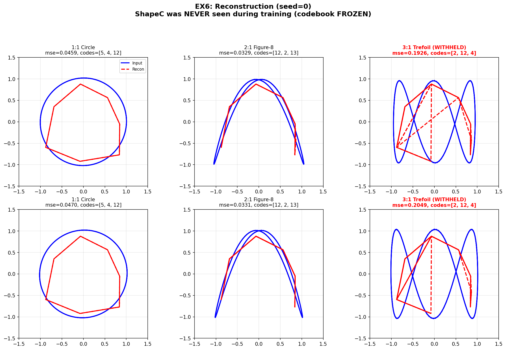

---

## EX7 — Relational time

**Question.** Do internal relational-time metrics track environment changes across worlds?

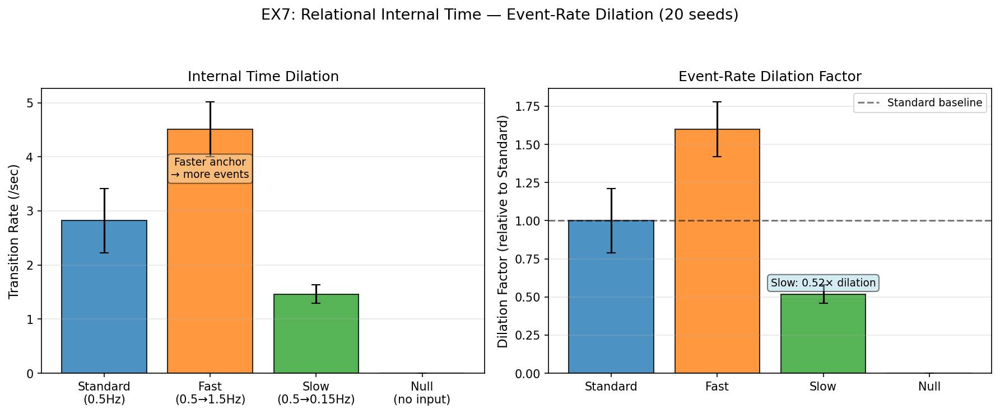

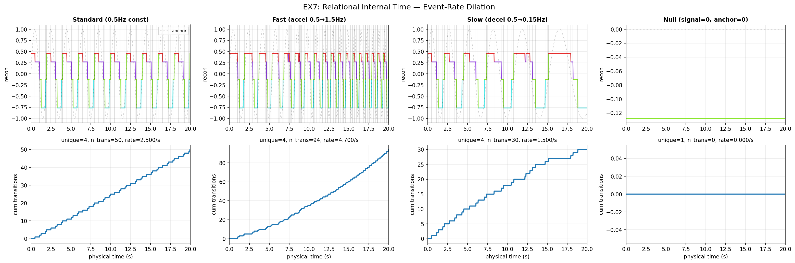

---

## EX8 — Semantic Grounding via Convex Hull

**Question.** Can a withheld primitive be inferred after codebook freezing? Does success depend on convex hull geometry?

**Key Results (Table-based, no figures):**

| Condition | Withheld Similarity | Success Rate |
|-----------|---------------------|--------------|
| IN_HULL   | 0.979 ± 0.025       | 96.7% (29/30) |
| RANDOM    | 0.682 ± 0.370       | 53.3% (16/30) |
| OUT_HULL  | 0.701 ± 0.242       | 16.7% (5/30)  |

Statistical significance: Kruskal–Wallis H = 42.52, p = 5.85 × 10⁻¹⁰

---

## EX9 — Syntax Inference via Barycentric Interpolation

**Question.** Can a withheld composite (B+C) be reconstructed using only trained primitives and composites?

**Key Results (Table-based, no figures):**

| Condition | Withheld Similarity | Success Rate |
|-----------|---------------------|--------------|
| IN_HULL   | 0.890 ± 0.138       | 66.7% (20/30) |
| RANDOM    | 0.767 ± 0.253       | 33.3% (10/30) |
| OUT_HULL  | 0.742 ± 0.168       | 13.3% (4/30)  |

Statistical significance: Kruskal–Wallis H = 19.13, p = 7.00 × 10⁻⁵

---

For full details, see the manuscript: [10.5281/zenodo.18408862](https://doi.org/10.5281/zenodo.18408862)
