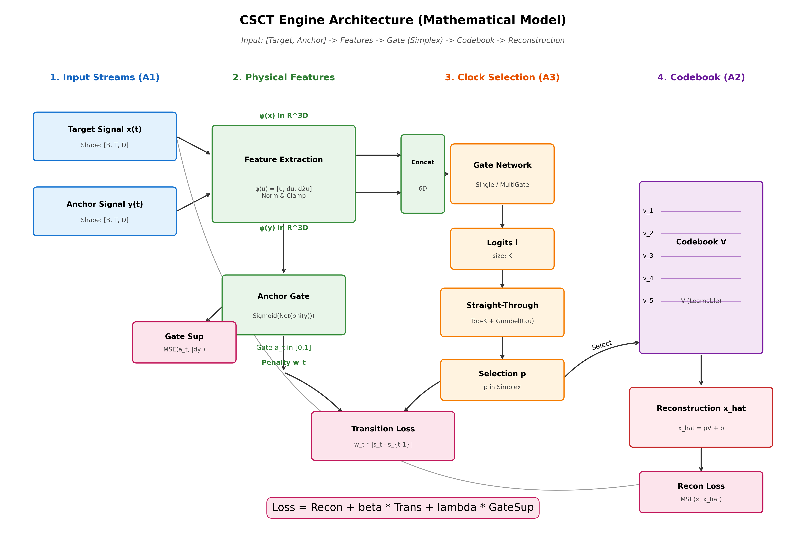

## Why cognition requires bounds

This site accompanies the CSCT manuscript **"Intelligence within Bounds: Why Cognition Requires a Closed Convex Hull"**.

CSCT (Clock-Selected Compression Theory) frames cognition as **inference constrained by an operational bound**: the system can only *reliably* infer within the region supported by anchored evidence (a *closed convex hull* of grounded primitives). Outside that bound, outputs are unconstrained and become structurally prone to hallucination.

<div style="margin: 1rem 0;">
  
</div>

## What you can find here

- **Paper source**: LaTeX and figure outputs in [`paper/`](../paper/)
- **Experiments**: high-level summaries and key figures
- **How to reproduce**: what to run (add your public repo links when ready)

### Pages

- [Experiments overview](experiments.md)
- [Metrics & reporting](metrics.md)
- [Reproduction checklist](reproduce.md)

## Core claim (operational)

- **Operational reporting criterion:** each experiment defines a success threshold (e.g., similarity ≥ 0.90) for *reporting* pass/fail.
- **Statistical analysis:** hypothesis tests are performed on continuous metrics (not the thresholded labels), unless explicitly stated.

## Links

- Code: [GitHub](https://github.com/CSCT-NAIL/csct)
- Preprint: [10.5281/zenodo.18408862](https://doi.org/10.5281/zenodo.18408862)

## Citation

```bibtex
@misc{higuchi2026csct,
  author       = {Higuchi, Naoki},
  title        = {Intelligence within Bounds: Why Cognition Requires a Closed Convex Hull},
  year         = {2026},
  publisher    = {Zenodo},
  doi          = {10.5281/zenodo.18408862},
  url          = {https://doi.org/10.5281/zenodo.18408862}
}
```
